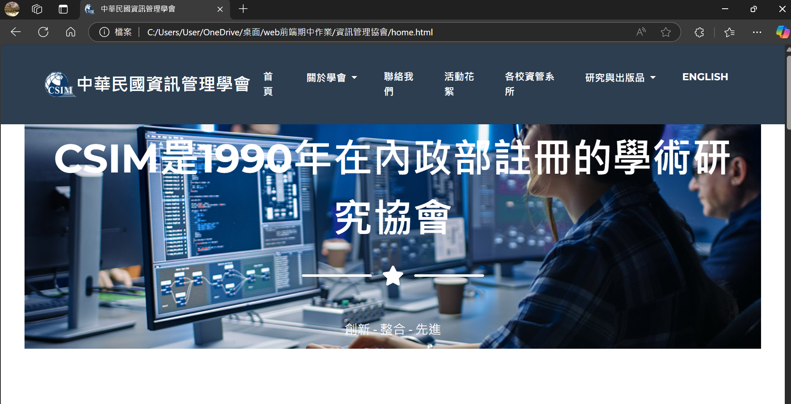
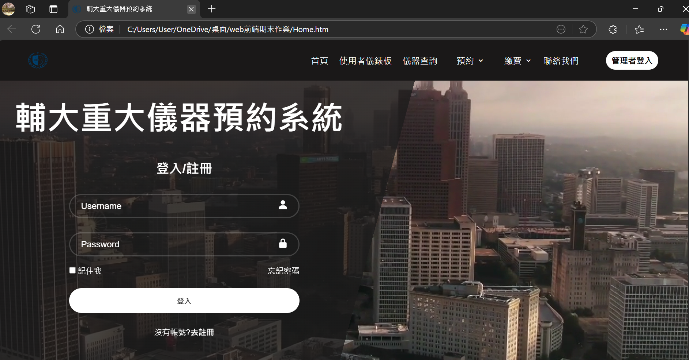
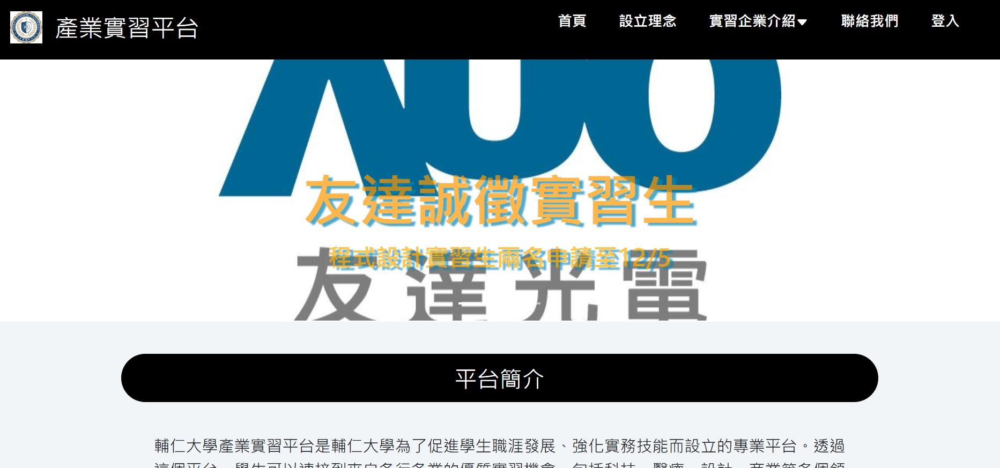
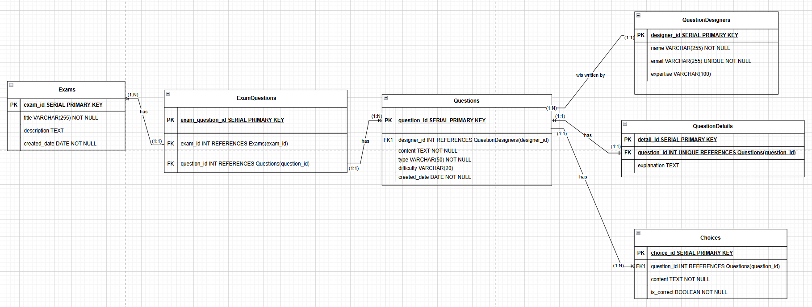
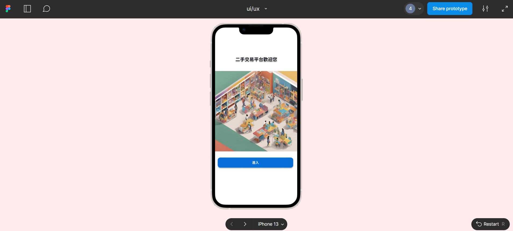
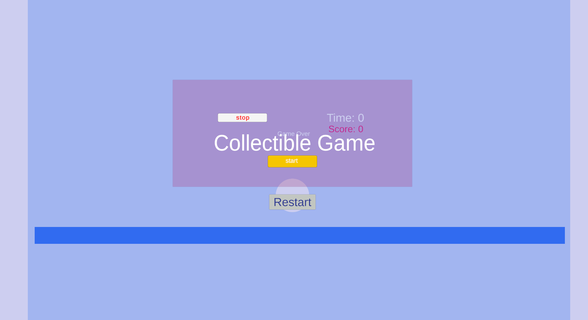

<!--
**Shan11111111/Shan11111111** is a ✨ _special_ ✨ repository because its `README.md` (this file) appears on your GitHub profile.

Here are some ideas to get you started:

- 🔭 I’m currently working on ...
- 🌱 I’m currently learning ...
- 👯 I’m looking to collaborate on ...
- 🤔 I’m looking for help with ...
- 💬 Ask me about ...
- 📫 How to reach me: ...
- 😄 Pronouns: ...
- ⚡ Fun fact: ...
-->
<h2>陳怡珊(Chen Yi-Shan)</h2>
<ul>
  <li>生日:2005/02/22</li>
  <li>就讀科系:輔仁大學/資訊管理學系</li>
  <li>位置:新北市</li>
  <li>e-mail:09shan2005@gmail.com</li>
  <li>ig:@dra_sha_iii
  <li>電話號碼:0909-165-648</li>
  <li>興趣：繪畫、寫程式、彈鋼琴</li>
</ul>

<audio controls autoplay>
  <source src="Echoes Rise(女聲).m4a" type="audio/m4a">
  <source src="Echoes Rise(女聲).m4a" type="audio/m4a">
  <source src="Echoes Rise(女聲).m4a" type="audio/m4a">  
</audio>

<h4>技能</h4>
<ul>
  <li>程式語言開發能力:Python（OpenCV, Selemium, Flask), C, Java, C# </li>
  <li>開發環境能力: Visual Studio Code, Unity 2D, Unity 3D</li>
  <li>版本控制能力：Git, GitHub</li>
  <li>運用軟體進行專案管理能力：Click Up</li>
  <li>基礎自動化測試腳本撰寫與Debug能力：Selemium</li>
  <li>網頁前端設計能力:HTML5, CSS, JavaScript, Three.js</li>
  <li>網頁後端設計能力:PHP, MySQL</li>
  <li>電腦繪圖軟體能力:PhotoShop, Photopea, Clip Studio Paint, Medibang, Krita, Adobe  illustrator 2022, Fresco, Procreate</li>
  <li>多媒體製作能力:Clip Studio Paint Pro, Procreate Dreams, Three.js</li>
  <li>文書處理能力:Word, Excel, PowerPoint, Canva</li>
  <li>AI應用能力：ChatGPT, Figma, Galio AI, Riffution</li>
</ul>

<h4>自傳</h4>
你們好! 我是來自輔仁大學資訊管理學系的陳怡珊，座右銘是「走過才會知道，繁華與寧靜適合不同的人」，我致力於實現團隊願景與個人價值提升，我在大學大一、大二時學習Python, C, Java, 
  MySQL, HTML5, CSS, PHP，這一路慢慢確立自己對於互動性質的系統開發最具興趣，因此根據興趣在大二、大三、大四時選修自己感興趣的課程，我目前修習C#與Unity遊戲設計的課程，在這之前，我曾經
  自主學習與ChatGPT協作ㄧ款2D unity小遊戲，我透過Debug與測試來讓小遊戲能夠跑動。除此之外，我也參與如何與團隊合作開發系統，我在團隊中，通常扮演提出一個願景、規劃邏輯設計與資料庫設計的
  後端主導者，當然我也能夠獨立開發系統，讓前端與後端、資料庫進行交互作用。我的生活除了寫程式，還有繪畫、音樂相關的創作，例如：我會把圖畫分享到經營的畫圖帳號，並擁有小眾的受眾，因此有了接單
  的經驗，能夠與客戶進行溝通，達成共識。我期望結合自己的繪畫能力與系統開發能力，打造具備互動體驗的系統，實現品牌與永續經營，創造更多創意價值給公司，達成雙贏的理想。以上是我的基本介紹，接下來
  是課程修習方面，除了系上的課程外，我也有參與資工系與應美系的課程，例如:離散數學。言簡之，我在大學期間接受了相當完整的資訊科技知識與開發系統的課程，我修習必修的成果如下：

  <ul>
    <ul>
      <li>資訊相關修課</li>
      <ul>
      <li>Web程式設計 A+</li>
        <ul>
          <li>PHP</li>
        </ul>
      <li>Web前端設計 A+</li>
        <ul>
          <li>HTML</li>
          <li>CSS</li>
          <li>JavaScript</li>
          <li>Bootstrap 5</li>
        </ul>
      <li>C語言 A+</li>
      <li>程式設計概論 A+</li>
        <ul>
          <li>Python</li>
        </ul>
      <li>進階程式設計 A-</li>
        <ul>
          <li>Python</li>
          <li>Java</li>
        </ul>
      <li>資料庫管理 A+</li>
        <ul>
          <li>MySQL</li>
        </ul>
      <li>資訊管理導論 A+</li>
      <li>創新與設計思考 A+</li>
        <ul>
          <li>Figma</li>
          <li>Galio AI</li>
        </ul>
      <li>系統設計與開發</li>
      <ul>
<li>PHP</li>
<li>Git</li>
<li>Selemium自動化測試</li>
<li>MySQL</li>
</ul>
      <li>資料通訊與網路</li>
      <li>資料結構</li>
      <li>智慧物聯網概論</li>
      </ul>
      <li>數學課程</li>
      <ul>
        <li>微積分(上 A+/下 A+)</li>
        <li>離散數學(一)(資工系) A+</li>
        <li>離散數學(二)(資工系)</li>
      </ul>
      <li>管理課程</li>
      <ul>
        <li>企業管理概論 A+</li>
        <li>生產與作業管理 A</li>
        <li>會計學(上 A+/下 A)</li>
        <li>統計學(上 A+/下)</li>
        <li>經濟學(上 A+/下)</li>
      </ul>
      <li>其他課程</li>
      <ul>
        <li>施工圖與工程管理(應美系) A+</li>
        <li>數位遊戲製作(應美系)</li>
      </ul>
    </ul>
  </ul>
  經由這些課程，讓我擁有:
  <ul>
    <li>熟悉HTML5, CSS, JavaScript應用</li>
    <li>熟悉PHP, MySQL基礎語法及後端連結前端的方法</li>
    <li>熟悉C語言的基礎寫法</li>
    <li>熟悉Python語法</li>
    <li>熟悉Java語法</li>
    <li>熟悉MySQL資料庫語法</li>
    <li>了解電腦運作的基礎邏輯原理</li>
    <li>熟悉企業運作與生產流程</li>
    <li>程式Debug的能力</li>
    <li>熟悉Unity與C#的程式應用</li>
  </ul>
上述不僅是我的學習成果，也是我大學時期致力於提升個人價值的累積證明，我可能不是最聰慧的成員，但我會是最努力的成員之一，
  我深知人外有人，天外有天，但是儘管如此，我的腳步也不曾輕易停下，不斷的學習並累積自己，時間自然會證明我的努力與付出！

<h4>校內經歷</h4>
<ul>
  <li>大一上書卷獎</li>  
  <li><a href="茲證明輔仁大學學校財團法人輔仁大學陳怡珊同學，.pdf">2024輔仁大學教育部偏鄉教育學伴計劃(程式設計) 優良大學伴獎狀</a></li>
  <li><a href='2024ESG與循環經濟研討會參加證明.pdf'>2024 ESG與循環經濟研討會 參加證明</a></li>  
  <li><a href="web程式設計課程第三名.pdf">web程式設計課程 第三名</a></li>
</ul>

<h4>校外經歷</h4>
    <ul>
      <li><a href="2024第三屆善科科技文藝獎_會外賽_參賽證明_陳怡珊.pdf">2024第三屆善科科技文藝獎[會外賽]參與</li>
      <ul>
        <li><a href="【電繪大專】陳怡珊.png">參賽作品</a></li>
      </ul>
    <li><a href="台日漫畫比賽參與證明_陳怡珊.pdf">2024第五屆台日學生原創插畫漫畫大賽 參與證明</a></li>
      <ul>
        <li><a href="插畫組-輔仁大學-陳怡珊-許願.png">作品一</a></li>
        <li><a href="插畫組-輔仁大學-陳怡珊-夜晚的守護者.png">作品二</a></li>
      </ul>
    <li><a href="AIOT智慧養殖線上專題講座.jpg">"連結台灣專題講座:AIOT與智慧養殖"線上會議 參與證明</a></li>
    <li><a href="2025生成式ai應用網頁設計競賽晉級決賽證明.pdf">2025 ITSA 生成式AI網頁設計試辦賽 決賽晉級證明</a></li>
    <li>2025 經濟部創新智慧大賞參與</li>
    </ul>

<h4>證照</h4>
<ul><li>全民英檢聽讀初級通過</li></ul>

<h4>作品集</h4>
<ul>
  <li><a href="資訊管理協會.7z">中華民國資訊管理協會(web前端課程作業)</a></li>
  
  
我負責"聯絡我們"、"研究與出版品"、"English"介面及其下拉式之相關介面

   
  <li><a href="web前端期末作業">儀器預約系統(web前端課程作業)</a></li>
  
  
我與兩位同學於大一下學期設計的資訊系統前端介面，我們使用HTML, CSS, Bootstrape, Github, JavaScript，模擬預約網站的介面，分工是每個人負責兩個導覽列選項之相關內容。我負責"預約"介面及其下拉式選單: "預約儀器"、"目前預約儀器"之介面設計以及"繳費"介面及其下拉式選單: "繳費情況"、"我要繳費"之介面設計

   
  <li><a href="產業實習平台(php,mysql,htm).7z">產業實習平台(Web程式設計課程作業)</a></li>
  
我與一位同學於大二上學期一起設計的資訊系統，我們使用PHP, mySQL, HTML, Xampp, Github, Bootstrape, JavaScript，功能主要圍繞新增、修改、刪除、查詢。

<ul>
  <ul>
    <li>我負責的後端部分:</li>
    <ul>
      <li>session權限存取</li>
      <li>test資料庫建置</li>
      <li>教師版面的企業CRUD</li>
      <li>教師版面的職缺CRUD</li>
      <li>教師的統計圖表查看</li>
      <li>管理者的問題回報RD</li>
      <li>管理者的統計圖表查看</li>
    </ul>
     
    <li>我負責的前端部分(HTML5+CSS+JavaScript+Bootstrape template樣板置入與美化版面):</li>
    <ul>
      <li>Bootstape icon置入</li>
      <li>未登入前的所有版面設計:首頁、設立理念、企業列表、聯絡我們、頁尾</li>
      <li>登入後學生版面:</li>
      <ol>
      <li>企業資訊列表</li>
      <li>實習資料上傳設計</li>
      <li>申請書上傳設計</li>
      <li>訂閱版面設計</li>
      </ol>
      <li>登入後教師版面:</li>
      <ol>
      <li>職缺表單設計</li>
      <li>企業表單設計</li>
      <li>訂閱標籤版面設計</li>
      </ol>
      <li>登入後管理者版面:</li>
      <ol>
      <li>問題回報設計</li>
      <li>統計圖表設計</li>
      </ol>
    </ul> 
  </ul>
   
  <ul>
    <li>多媒體動畫與繪圖製作:</li>
    <ul>
      <li>等待小動畫:toothless animation</li>
      
利用Clip Studio Paint Pro製作的小動畫

    
  </ul>
</ul>
</ul>
</ul>
   
<ul>
  <li><a href="https://fjuedu-my.sharepoint.com/:v:/g/personal/412402141_m365_fju_edu_tw/EWKVJAHxJy5DolX-hUdaLcQB733R8vNktbI-CLI8vo-PZg?e=xidQqe&nav=eyJyZWZlcnJhbEluZm8iOnsicmVmZXJyYWxBcHAiOiJTdHJlYW1XZWJBcHAiLCJyZWZlcnJhbFZpZXciOiJTaGFyZURpYWxvZy1MaW5rIiwicmVmZXJyYWxBcHBQbGF0Zm9ybSI6IldlYiIsInJlZmVycmFsTW9kZSI6InZpZXcifX0%3D">題庫資料庫建置影片(資料庫管理)</a></li>
  
      
資料庫管理這門課教MySQL，我自主學習postgreSQL來建置資料庫，我自訂的題目是存放題庫為主的資料庫，會選擇題庫做為題目是源於我使用線上題庫的系統寫題目時有時候會想有一些寫題目獎勵或是出題獎勵，如果題目可以依難易度分類，查找內容的時候會更方便，基於這個理念做出來的個人作業。

      <ul>
        <li>包含六個資料表、商業規則，及三種關係:一對一、一對多、多對多</li>
        <li>設計十種查詢</li>
      </ul>
 
  <li><a href="https://www.figma.com/proto/tNEnqHL50XemTEUaU6k3sw/ui%2Fux?node-id=246-3754&starting-point-node-id=246%3A3754&t=IVt0sHTeufGB4eUP-1">二手物平台介面設計(創新與設計思考)</li>
    
    
這是一組五人利用Figma設計手機介面並兼具SDGs的第十二項目標責任消費理念的團隊課堂作業，我負責:

    <ul>
      <li>登入登出及註冊的介面設計</li>
      <li>通知設定的藍點及白點轉換介面設計</li>
      <li>管理者審核貼文之相關介面</li>
    </ul>
 
  <li><a href="吃點點遊戲.7z">吃點點遊戲</a></li>
    
  
<b>個人獨立研發的小遊戲採用unity 2D開發，以下是遊玩介紹:</b>

  
解壓縮完後，點擊資料夾中的eat_dot來玩這款吃點點小遊戲吧! 透過左鍵及右鍵控制角色(球)左右移動、空白鍵跳躍，來吃紅色的點點，在三十秒內若角色吃到5個點點則獲勝，反之，則遊戲結束 ; 若想要在玩一次請點選restart鍵，暫停請按stop鍵，再按一次stop鍵則代表取消暫停，繼續開始遊戲，祝您有美好的遊戲體驗~

  </ul>
 
<li>soap語音紀錄助手</li>

透過chatGPT金鑰，連結大語言模型，能夠記錄一段話並將內容切成soap格式存儲在資料庫裡。

    <iframe 
      src="https://www.youtube.com/embed/P-S-ICTIxD8" 
      title="YouTube video player" 
      style="position:absolute; top:0; left:0; width:100%; height:100%;" 
      frameborder="0" 
      allow="accelerometer; autoplay; clipboard-write; encrypted-media; gyroscope; picture-in-picture" 
      allowfullscreen>
    </iframe>
  

    
<li>孵仁養雞募資平台(系統設計與開發之作品)</li>

改良校內的愛校建言系統的系統開發

